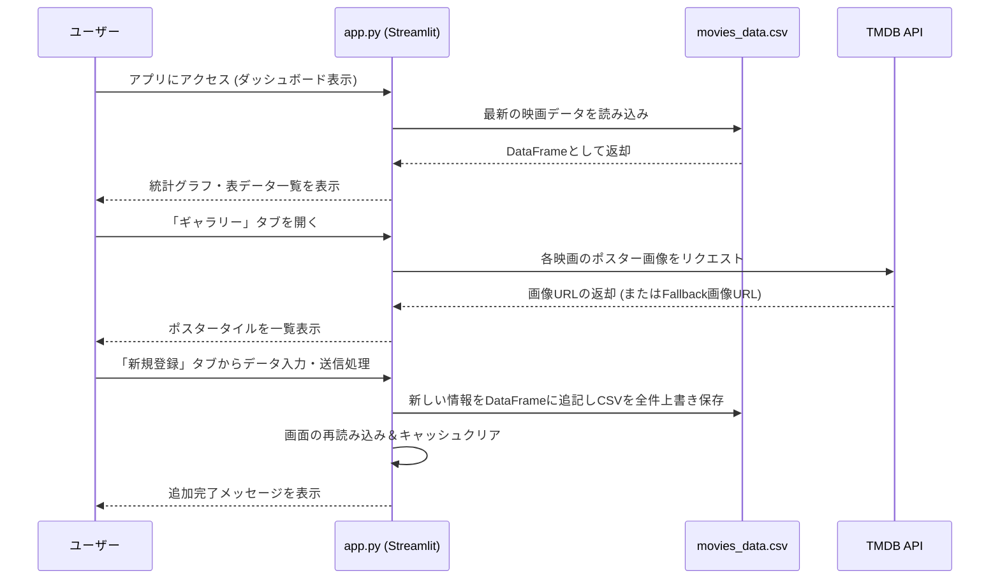

# My Cinema Dashboard システム仕様書

## 1. システム概要
本システムは、PDFデータ等で記録された個人の各種映画鑑賞記録を抽出し、CSVデータとして管理・可視化するためのアプリケーションです。Streamlitを用いたインタラクティブなダッシュボードが用意されており、監督名やキャスト名指定を含むフリーワード検索での絞り込み、鑑賞履歴の統計グラフ表示、TMDB API連携によるポスターギャラリーおよびタグリング表示機能を提供します。また、ブラウザ上のUIから新しい鑑賞記録を容易に追加し、データベース（CSVファイル）を更新することが可能です。

## 2. 動作環境・環境変数
- **主要動作要件**:
  - Python 3.x
  - ライブラリ: `streamlit`, `pandas`, `requests`, `pdfplumber`
- **外部API**:
  - TMDB (The Movie Database) API: 映画のポスター画像を取得するために利用。
- **環境変数（設定値）**:
  現在、設定値は `app.py` などのソースコード内に直接記述されていますが、セキュリティと保守性の観点から `.env` 等で環境変数として分離して管理することが推奨されます。
  - `TMDB_API_KEY`: TMDBのAPIを利用するための固有キー。
  - `CSV_FILE`: データベースとなるCSVファイルの保存パス（デフォルト: `movies_data.csv`）。

## 3. ディレクトリ構成
```text
Antigravity_Movie/
├── app.py                      # ダッシュボード(Web UI)機能を提供するメインアプリケーション
├── extract_data.py             # PDFからテキストデータを読み取り、CSVへ変換・抽出する初期データ移行スクリプト
├── find_missing_posters.py     # 既存データ中、TMDB APIでポスターが取得できない作品を特定するチェックツール
├── movies_data.csv             # 映画の各種メタデータを格納したメインのデータベース（本システムのデータの源泉）
├── 🎥映画記録 - 鑑賞記録.pdf    # 初期データ抽出の元となったソースファイル
├── test_gundam.py              # 特定の映画タイトルのTMDB API検索精度を確認するためのテストスクリプト
├── test_pdf.py                 # pdfplumberによるPDFテーブル抽出処理の動作検証用スクリプト
└── run_app.command             # ターミナル操作を自動化し、ダブルクリックでアプリを起動するためのMac用シェルスクリプト
```

## 4. 全体処理フロー
システムは主に「初期データ移行フロー」と「ダッシュボード表示・更新フロー」の2軸で動作します。以下は主要なインタラクティブ処理（アプリ起動〜運用）のフローです。



## 5. 主要モジュール・関数仕様

### `app.py` (メインアプリ)
- **`load_data(file_mtime)`**:
  - *役割*: `movies_data.csv` を読み込み、初期の型変換（数値やBooleanへのキャスト）および欠損値の補填を行う。また、拡張された「監督」「主要キャスト」列が存在しない場合の初期化や空文字化も担う。
  - *引数*: ファイルの最終更新日時（Streamlitのキャッシュ無効化制御用）
  - *戻り値*: 整形済みデータが格納された pandas DataFrame。
- **`save_data(df)`**:
  - *役割*: 引数で渡された DataFrame 全体を、UTF-8(BOM付き)エンコーディングで `movies_data.csv` に上書き保存する機能。
- **`fetch_movie_poster(title, original_title, year, api_key)`**:
  - *役割*: 指定された邦題、原題、公開年を用いてTMDB APIを検索し、適切なポスター画像のURLを一意に特定して返す。APIリクエスト削減のためのキャッシュ機構(`@st.cache_data`)が設定されている。
  - *戻り値*: ポスター形式のURL文字列。（API通信エラーや解当なしの場合はプレースホルダー用画像のURL）
- **`main()`**:
  - *役割*: Streamlitの各種ウィジェットやタブ（ダッシュボード、ギャラリー、新規追加）を描画する。上部のフリーワード検索ボックス（邦題・原題・監督・キャストをOR検索）によるリアルタイムフィルタリングや、画面遷移を制御する全体システムのエントリポイント。

### `extract_data.py` (初期データ抽出ツール)
- **`extract_pdf_data(pdf_path, csv_path)`**:
  - *役割*: `pdfplumber` を用いてPDFドキュメントの各ページからテーブル情報をスキャンし、セル内改行の結合などのクレンジング処理を施した後、所定のカラム形式としてCSVファイルに出力する。

## 6. データ構造・データベース定義
メインデータは `movies_data.csv` 内で以下のカラム・スキーマ定義で保管されています。

| カラム名 | データ型 | 説明 |
| :--- | :--- | :--- |
| **No** | int | 鑑賞履歴を特定する一連番号 |
| **邦題** | str | 映画の日本語タイトル（入力必須項目） |
| **原題** | str | 映画のオリジナル（原語）タイトル |
| **公開年** | str | 公開された年月日や対象年（例: "2014年"） |
| **評価** | int/str | ユーザーによる独自レビューのスコア (1〜10) |
| **殿堂入り** | bool | 特別にお気に入りの殿堂入り作品であるかどうかのフラグ表示 (True/False) |
| **鑑賞日** | str | 鑑賞した日付文字列（YYYY/MM/DD フォーマット等） |
| **鑑賞場所** | str | 長野グランドシネマズやNetflixなど、鑑賞した劇場・環境名 |
| **上映方式** | str | 字幕、吹替、IMAX、2Dなどのスクリーン方式 |
| **監督** | str | 自動取得または手動入力された当該映画の監督名 |
| **主要キャスト** | str | 自動取得または手動入力された上位2〜3名の主要キャスト名（カンマまたは読点区切り） |

## 7. 実行方法

### 簡便な起動方法 (Mac推奨)
ルートディレクトリにある **`run_app.command`** をFinderからダブルクリックするだけで、ターミナルが自動で立ち上がり、仮想環境の有効化からアプリの起動まで全自動で行われます。
※ 初回実行時に「開発元が未確認のため開けません」という警告が出た場合は、右クリックから「開く」を選択してください。

### 手動でのターミナル起動方法
以下のコマンドをOSのターミナルで手動実行することでも起動・運用できます。

```bash
# 1. 仮想環境の有効化 (仮想環境を使用している場合)
source venv/bin/activate
# または conda activate など、環境に合ったコマンドを使用

# 2. 依存ライブラリのインストール
pip install streamlit pandas requests pdfplumber

# 3. アプリケーションの起動
streamlit run app.py
```
*(※ PDFからのデータを新規で全量抽出してCSV化する場合は、起動前に `python extract_data.py` を実行します)*

## 8. 今後の拡張性・保守の注意点

システムを今後拡張・改修していく際に配慮すべき、あるいはボトルネックとなり得るポイントは以下の通りです。

1. **データ永続化方式のRDB化によるボトルネック解消**:
   - 現行の実装は、新規データ追加や変更のたびに全件データを一括でCSVファイルへと**上書き保存**（`save_data`）しています。今後のデータ増加時におけるファイルアクセスパフォーマンス低下や、複数画面操作時のデータ破損リスクを回避するために、SQLiteやPostgreSQL等のスケーラブルなRDB（リレーショナルデータベース）への移行が推奨されます。
2. **公開年のデータフォーマットの正規化**:
   - CSV内の `公開年` の値が "2014年" のような文字列表現を含んでいます。ソースコード上で検索やTMDBへのAPIクエリを行う際、文字列置換(`replace('年', '')`)が頻発しているため、入出力時に純粋な西暦（`int`）に規格化（データクレンジング）することで、将来的なデータの複合ソートや時系列集計の開発が容易になります。
3. **APIキーなどの設定値のセキュアな分離保守**:
   - `app.py` などのファイル内に `TMDB_API_KEY` のようなセキュアな設定値がハードコードされた状態で保存されています。これを `.env` などの環境変数ファイルに分離し、`python-dotenv`等で読み込む実装に改変することで、ソースコード管理(Git)での意図せぬ漏洩事故を防ぐことができます。
4. **APIレートリミット対策（表示の遅延読み込み）**:
   - Streamlitのギャラリータブを開くと、一画面で数十から数百のポスター情報の取得要求がTMDB側へ動的に発生する場合があります。現在は `app.py` 内部での1日間のローカルキャッシュ（`@st.cache_data`）で通信を軽減させていますが、根本解決に向けて画像自体のファイル保存によるローカル配信化や、スクロールイベントなどに連動した遅延読み込み（Lazy Loading）機能の導入を検討してください。
